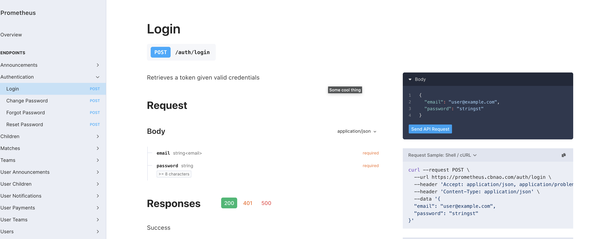
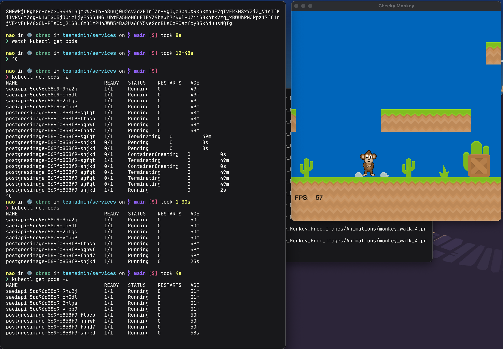
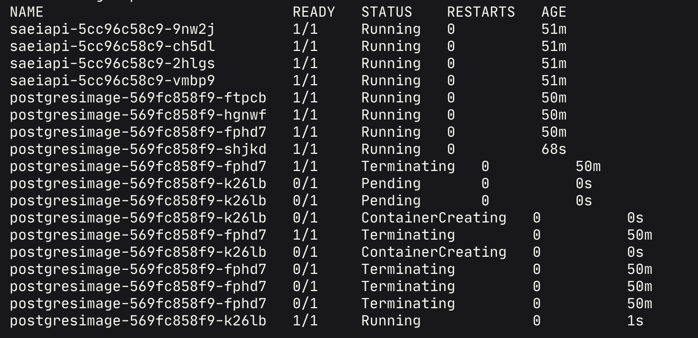

# TeamAdmin

De la Cruz Belmonte Christian Omar - 213625735  

Proyecto final, conversion del sistema de TeamAdmin a utilizar herramientas tolerantes a fallas.

---

## Indice

- [Instalar Microk8s](#instalar-microk8s)

- [Desplegar](#desplegar)

- [Probando con cheeky monkey](#probando-con-cheeky-monkey)

---

### Instalar Microk8s

**[`^        Regresar al inicio        ^`](#teamadmin)**

Microk8s se trata de un software que nos permite montar un sistema utilizando kubernetes de una forma sencilla y rapida, manteniendo la mayoria de las funcionalidades de kubernetes.

Para empezar debemos instalar `snap` ya que dentro de este se encuentra el software Microk8s, esta instalación dependera del sistema operativo.
Para ver la manera en que se debe instalar ver en [Installing snapd](https://snapcraft.io/docs/installing-snapd)

Una vez instalado `snap` ejecutamos el siguiente comando

```bash
sudo ln -s /var/lib/snapd/snap /snap
echo 'export PATH=$PATH:/var/lib/snapd/snap/bin' | sudo tee -a /etc/profile.d/snap.sh
source /etc/profile.d/snap.sh
```

Este comando nos permite habilitar las instalaciones clasicas dentro de snap.
Despues de esto ejecutamos lo siguiente para instalar Microk8s:

```bash
sudo snap install microk8s --classic 
```

Una vez instalado, debemos agregar nuestro usuario al grupo Microk8s para poder utilizar los comandos. Despues de agregado es necesario reiniciar sesión para que los grupos sean aplicados.

```bash
sudo usermod -a -G microk8s $USER
sudo chown -f -R $USER ~/.kube

# Salimos de la sesion
exit
```

Verificamos que el servicio se encuentre ejecutandose correctamente

```bash
microk8s status
```

Esto nos dara una salida como esta:

```bash
❯  microk8s status
microk8s is running
high-availability: no
  datastore master nodes: 134.195.91.254:19001
  datastore standby nodes: none
addons:
  enabled:
    istio                # (community) Core Istio service mesh services
    community            # (core) The community addons repository
    dashboard            # (core) The Kubernetes dashboard
    dns                  # (core) CoreDNS
    ha-cluster           # (core) Configure high availability on the current node
    helm                 # (core) Helm - the package manager for Kubernetes
    helm3                # (core) Helm 3 - the package manager for Kubernetes
    hostpath-storage     # (core) Storage class; allocates storage from host directory
    metrics-server       # (core) K8s Metrics Server for API access to service metrics
    storage              # (core) Alias to hostpath-storage add-on, deprecated
  disabled:
    argocd               # (community) Argo CD is a declarative continuous deployment for Kubernetes.
```

Creamos un alias dentro de nuestro archivo `~/.bashrc` para poder tener acceso al comando `kubectl` de una manera mas comoda.

```bash
alias kubectl='microk8s kubectl'
```

### Desplegar

**[`^        Regresar al inicio        ^`](#teamadmin)**

Ahora que tenemos Microk8s instalado podemos comenzar a desplegar nuestros servicios, primero es necesario generar la imagen de docker de nuestra API y agregarla a las imagenes de Microk8s

Navegamos a la carpeta `{Carpeta_Git}/src` y ejecutamos el comando

```bash
docker build . -f dockerfile -t teamadmin
```

Una vez generada la imagen obtenemos el archivo `tar` de la imagen con el comando

```bash
docker save localhost/teamadmin > teamadmin.tar
```

Esto nos permitira importarla a microk8s, para esto ahora corremos el comando 

```bash
microk8s ctr image import teamadmin.tar
```

Con el comando ejecutado ahora podemos desplegar nuestros sistema, esto se encuentra dentro del archivo `apply` en la carpeta `services`

```bash
kubectl apply -f download-persistentvolumeclaim.yaml,postgresimage-deployment.yaml,postgresimage-service.yaml,saei-db-volume-persistentvolumeclaim.yaml,saeiapi-deployment.yaml,saeiapi-service.yaml,vouchers-persistentvolumeclaim.yaml
```

Podremos ver que se ha iniciado correctamente visualizando que la salida del comando sea como lo siguiente:

```bash
❯ kubectl apply -f download-persistentvolumeclaim.yaml,postgresimage-deployment.yaml,postgresimage-service.yaml,saei-db-volume-persistentvolumeclaim.yaml,saeiapi-deployment.yaml,saeiapi-service.yaml,vouchers-persistentvolumeclaim.yaml
persistentvolumeclaim/download configured
deployment.apps/postgresimage created
service/postgresimage configured
persistentvolumeclaim/saei-db-volume configured
deployment.apps/saeiapi created
service/saeiapi configured
persistentvolumeclaim/vouchers configured
```

Con esto ahora nuestro sistema se encontrará disponible en el puerto 6500, para ver la ClusterIP ejecutamos el comando 

```bash
❯ kubectl get services
NAME            TYPE        CLUSTER-IP       EXTERNAL-IP   PORT(S)    AGE
kubernetes      ClusterIP   10.152.183.1     <none>        443/TCP    10h
postgresimage   ClusterIP   10.152.183.179   <none>        5432/TCP   178m
saeiapi         ClusterIP   10.152.183.200   <none>        6500/TCP   178m
```



---

### Cheeky Monkey

**[`^        Regresar al inicio        ^`](#teamadmin)**



